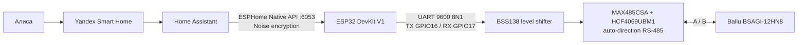

# Ballu BSAGI-12HN8 + ESPHome

Приватный воспроизводимый source-проект управления кондиционером **Ballu iGreen Pro DC BSAGI-12HN8** через штатную Hisense RS-485 шину с использованием **ESP32 DevKit V1**, ESPHome и Home Assistant.

> [!IMPORTANT]
> Это рабочая конфигурация, проверенная на одном реальном BSAGI-12HN8. Она не является официальной прошивкой Ballu/Hisense и не гарантирует совместимость с другими моделями или аппаратными ревизиями.

## Проверенный статус

| Уровень | Результат |
|---|---|
| ESP32 | ESP32-WROOM-32 / ESP32-D0WD-V3 rev. 3.1 |
| ESPHome | 2026.6.5 |
| UART | 9600 8N1, TX GPIO16, RX GPIO17 |
| Физический интерфейс | MAX485CSA + HCF4069UBM1, automatic direction, BSS138 level shifting |
| ESP32 → кондиционер | Проверено командами LED и изменением setpoint |
| Кондиционер → ESP32 | Проверен 150-байтный status response `0x66` |
| Home Assistant | Native API с Noise encryption, climate entity и диагностика |
| Голосовое управление | Через Home Assistant → Yandex Smart Home → Алиса |

## Возможности

- включение и выключение;
- режимы `COOL`, `HEAT`, `DRY`, `FAN_ONLY`, `AUTO/SMART`;
- целевая и текущая температура;
- скорости вентилятора, включая Quiet и Turbo;
- вертикальные/горизонтальные жалюзи;
- Boost, Eco, Sleep 1–4, Quiet, +8 °C;
- управление дисплеем и звуком команд;
- сохранение последнего рабочего режима (`Memory`);
- ProductType/capabilities;
- температуры трубки, наружного блока, конденсатора и нагнетания;
- частоты компрессора;
- humidity fields, fault flags и таймеры;
- Kelon168/iFeel при наличии настроенного IR transmitter/MQTT backend;
- фильтрация собственного RS-485 echo.

---

## Архитектура



### Поток данных

```text
Команда HA
  → ESPHome ClimateCall
  → neutral one-shot frame 0x65
  → UART / RS-485
  → внутренний контроллер кондиционера

Status query 0x66
  → UART / RS-485
  → локальное 21-byte echo от auto-direction bridge (отбрасывается)
  → настоящий 150-byte response от кондиционера
  → checksum/framing validation
  → climate state + diagnostics
  → Home Assistant
```

Компонент сериализует status-запросы и write-команды. Собственное echo имеет `direction byte[2] == 0`; ответ кондиционера — `byte[2] == 1`. Echo не считается подтверждением и не снимает timeout.

---

## Аппаратная часть

### Минимальный состав

- ESP32 DevKit V1 / ESP32-WROOM-32;
- автоматический RS-485 bridge на MAX485-совместимом трансивере;
- level shifter BSS138 для линий TX/RX между 3,3 В и 5 В;
- общий GND;
- желательно 470 мкФ + 100 нФ по питанию ESP32 и 100 нФ возле RS-485 bridge.

### Схема подключения

```text
                         ┌─────────────────────────────┐
                         │ Ballu BSAGI-12HN8           │
                         │ service / Wi-Fi connector   │
                         └──────┬──────┬──────┬────────┘
                                │ +5V  │ GND  │ A / B
                                │      │      │
              ┌─────────────────┘      │      └──────────────┐
              │                        │                     │
        ┌─────▼─────┐            ┌─────▼─────┐       ┌──────▼─────────┐
        │ ESP32 VIN │            │ Common GND│       │ RS-485 A+ / B- │
        └───────────┘            └───────────┘       │ MAX485/CD4069  │
                                                     └───▲────────▲───┘
                                                         │ TXD    │ RXD
                                                     5 V │        │ 5 V
                                                  ┌──────┴────────┴──────┐
                                                  │ BSS138 level shifter │
                                                  │ HV=5V, LV=3V3        │
                                                  └──────▲────────▲──────┘
                                                         │        │
                                               GPIO16 TX │        │ GPIO17 RX
                                                  ┌──────┴────────┴──────┐
                                                  │ ESP32 DevKit V1      │
                                                  └──────────────────────┘
```

Точная таблица:

| Откуда | Куда |
|---|---|
| Ballu `+5V` | ESP32 `VIN`, VCC RS-485 bridge, `HV` BSS138 |
| ESP32 `3V3` | `LV` BSS138 |
| Ballu/ESP32/bridge/BSS138 `GND` | общий GND |
| Ballu `A` | `A+` RS-485 bridge |
| Ballu `B` | `B-` RS-485 bridge |
| ESP32 GPIO16 (`TX`) | LV1 → HV1 → `TXD` bridge |
| `RXD` bridge | HV2 → LV2 → ESP32 GPIO17 (`RX`) |

> [!CAUTION]
> Никогда не переставляй проводку под напряжением. Перед подключением полностью обесточь кондиционер, ESP32 и RS-485 bridge.

> [!CAUTION]
> Не питай ESP32 одновременно от USB и от Ballu, если конкретная плата не имеет подтверждённой защиты от backfeed. Для первичной USB-прошивки ESP32 должна быть физически отключена от питания кондиционера.

### Что нельзя заключать по внешнему виду

- TTL UART и RS-485 — разные электрические интерфейсы;
- совпадающий разъём не доказывает совместимость;
- A/B нельзя менять при включённом питании;
- дешёвые auto-direction модули могут возвращать локальное echo — это ожидаемо для проверенного bridge.

---

## Структура репозитория

```text
.
├── ballu-bsagi-12hn8.yaml       # production ESPHome configuration
├── secrets.example.yaml         # только placeholders
├── AC-Hisense/
│   ├── UPSTREAM-README.md
│   └── components/ac_hi/        # полный используемый component snapshot
├── docs/
│   ├── PROTOCOL.md
│   ├── HOME-ASSISTANT.md
│   ├── TROUBLESHOOTING.md
│   └── VERIFICATION.md
├── scripts/
│   ├── build.sh
│   └── verify_repository.py
├── patches/upstream-to-production.patch
├── SOURCE-MANIFEST.json
└── .github/workflows/build.yml
```

Реальный `secrets.yaml`, `.esphome`, `.pio`, firmware binaries и credentials намеренно не версионируются.

---

## Подготовка секретов

```bash
cp secrets.example.yaml secrets.yaml
```

Заполни:

```yaml
wifi_ssid: "YOUR_WIFI"
wifi_password: "YOUR_WIFI_PASSWORD"
fallback_password: "RANDOM_FALLBACK_AP_PASSWORD"
api_encryption_key: "BASE64_32_BYTE_KEY"
ota_password: "RANDOM_OTA_PASSWORD"
```

Сгенерировать ключи можно так:

```bash
openssl rand -base64 32   # API encryption key
openssl rand -hex 24      # OTA/fallback password
```

`secrets.yaml` запрещено коммитить даже в приватный репозиторий: Git сохраняет историю удалённых значений.

---

## Сборка

### Linux/macOS

```bash
git clone git@github.com:SpiderMorion/ballu-bsagi-12hn8-esphome.git
cd ballu-bsagi-12hn8-esphome
python3 -m venv .venv
. .venv/bin/activate
python -m pip install --upgrade pip
python -m pip install -r requirements.txt
cp secrets.example.yaml secrets.yaml
# отредактировать secrets.yaml
esphome config ballu-bsagi-12hn8.yaml
esphome compile ballu-bsagi-12hn8.yaml
```

### Windows PowerShell

```powershell
git clone https://github.com/SpiderMorion/ballu-bsagi-12hn8-esphome.git
cd ballu-bsagi-12hn8-esphome
py -3.11 -m venv .venv
.\.venv\Scripts\Activate.ps1
python -m pip install --upgrade pip
python -m pip install -r requirements.txt
Copy-Item secrets.example.yaml secrets.yaml
# отредактировать secrets.yaml
esphome config ballu-bsagi-12hn8.yaml
esphome compile ballu-bsagi-12hn8.yaml
```

После компиляции ESPHome создаёт, в частности:

```text
.esphome/build/ballu-bsagi-12hn8/.pioenvs/ballu-bsagi-12hn8/firmware.factory.bin
.esphome/build/ballu-bsagi-12hn8/.pioenvs/ballu-bsagi-12hn8/firmware.ota.bin
```

Путь может незначительно меняться между версиями ESPHome. Используй вывод `esphome compile` как источник истины.

---

## Первичная прошивка ESP32

### Вариант A: ESPHome CLI

1. Полностью отключи ESP32 от Ballu/RS-485 питания.
2. Подключи ESP32 к компьютеру только USB-кабелем.
3. Найди serial port.
4. Выполни:

```bash
esphome run ballu-bsagi-12hn8.yaml --device /dev/ttyUSB0
```

Windows:

```powershell
esphome run ballu-bsagi-12hn8.yaml --device COM5
```

### Вариант B: ESPHome Web

1. Скомпилируй проект.
2. Открой <https://web.esphome.io/> в Chrome/Chromium.
3. Выбери **Connect → Install → Select file**.
4. Укажи `firmware.factory.bin`.
5. Дождись подтверждения записи и отключи USB.

### Подключение к кондиционеру после прошивки

1. Полностью обесточь все узлы.
2. Подключи питание, GND, TX/RX level shifter и A/B по схеме.
3. Убери USB-кабель.
4. Включи питание кондиционера.
5. Подожди подключения ESP32 к Wi-Fi.

---

## OTA-обновление

```bash
esphome run ballu-bsagi-12hn8.yaml --device ballu-bsagi-12hn8.local
```

Если mDNS между сетями не маршрутизируется, укажи IP:

```bash
esphome run ballu-bsagi-12hn8.yaml --device 192.168.x.y
```

OTA требует пароль из `secrets.yaml`. Не публикуй TCP 3232 в интернет; используй LAN, VPN или site-to-site tunnel.

---

## Интеграция с Home Assistant

### 1. Добавление ESPHome

Обычно HA обнаруживает устройство автоматически. Если нет:

1. **Settings → Devices & services → Add integration**.
2. Выбери **ESPHome**.
3. Введи IP/hostname ESP32 и порт `6053`.
4. Введи API encryption key из `secrets.yaml`.

Не используй OTA password вместо API key.

### 2. Сущности компонента

При минимальной конфигурации из этого репозитория компонент создаёт climate entity и набор встроенных сущностей:

| Категория | Сущности |
|---|---|
| Climate | режим, power, target/current temperature, fan, swing, action, presets |
| Configuration | `AC LED`, `AC Command Sound`, `Memory` |
| Program | `Sleep Program` selector |
| Temperatures/status | setpoint, room, pipe, outdoor/condenser/exhaust при включённых schema defaults |
| Compressor | actual/set/command frequency |
| Timers | remaining/active/text для power-on и power-off timer |
| Diagnostics | ProductType capabilities, fault flag, active fault text, humidity fields |

Имена и фактический набор определяются schema `AC-Hisense/components/ac_hi/climate.py`; optional heap/PSRAM diagnostics создаются только при явном добавлении соответствующих YAML keys.

Рекомендуется:

- назначить устройство в Area комнаты;
- добавить Label дома/объекта;
- на dashboard добавить стандартную Thermostat card;
- экспортировать в голосовой ассистент только climate entity, не диагностические sensors/switches.

Пример Lovelace:

```yaml
type: thermostat
entity: climate.ballu_bsagi_12hn8_konditsioner
name: Кондиционер
```

Фактический `entity_id` зависит от friendly name и существующих сущностей в HA.

### 3. Memory — восстановление предыдущего режима

Компонент создаёт configuration switch `Memory`. При `Memory=ON` включение из состояния OFF восстанавливает последний активный HVAC mode и remembered setpoint для COOL/HEAT.

Это особенно важно для Yandex Smart Home: неспецифичная команда «включи кондиционер» может прийти в HA как `AUTO`. Memory перехватывает такой power-on и восстанавливает последний режим вместо входа в SMART.

Для постоянного включения Memory создай automation:

```yaml
alias: Ballu — keep previous mode memory enabled
triggers:
  - trigger: homeassistant
    event: start
  - trigger: state
    entity_id: switch.ballu_bsagi_12hn8_memory
    to: "off"
conditions:
  - condition: state
    entity_id: switch.ballu_bsagi_12hn8_memory
    state: "off"
actions:
  - action: switch.turn_on
    target:
      entity_id: switch.ballu_bsagi_12hn8_memory
mode: restart
```

Проверь фактический `entity_id` Memory в своей HA instance.

### 4. Yandex Smart Home / Алиса

Рекомендуемый путь:

```text
Ballu ↔ ESPHome ↔ Home Assistant ↔ Yandex Smart Home ↔ Алиса
```

Экспортируй только climate entity. Не публикуй HA, ESPHome API или OTA порты напрямую в интернет. OAuth/облачную интеграцию настраивай интерактивно в HA и приложении «Дом с Алисой».

При включении панель может кратко показать текущую комнатную температуру, затем целевую. Если история HA показывает непосредственный переход `OFF → COOL/HEAT` с прежним setpoint и без `AUTO`, это нормальная индикация, а не смена уставки.

---

## Протокол и принцип работы

Логический Hisense frame:

```text
F4 F5 | direction | 40 | length | ... | command@13 | payload | checksum_hi checksum_lo | F4 FB
```

- logical size: `frame[4] + 9`;
- checksum: 16-bit additive sum bytes `[2, n-4)`;
- internal `F4` stuffing: `F4 → F4 F4`, кроме header/footer;
- status/capabilities command: `0x66`;
- write/ACK command: `0x65`;
- status subtype: `0x00`;
- capabilities subtype: `0x40`;
- local request/echo direction: `0x00`;
- appliance response direction: `0x01`.

Проверенный status query:

```text
F4 F5 00 40 0C 00 00 01 01 FE 01 00 00 66 00 00 00 01 B3 F4 FB
```

Проверенный ответ имеет 150 логических байт, `byte[4]=0x8D`, command `0x66`. Подробности — [docs/PROTOCOL.md](docs/PROTOCOL.md).

---

## Диагностика

### Wi-Fi/API работают, но кондиционер не отвечает

Проверь по порядку:

1. UART именно `TX GPIO16`, `RX GPIO17`, `9600 8N1`.
2. `logger.baud_rate: 0`, чтобы системный UART не мешал.
3. Общий GND.
4. Level shifting 3,3 ↔ 5 В.
5. A/B только при снятом питании.
6. Логи: отличай 21-byte local echo от 150-byte appliance response.

### Есть точное 21-byte echo, но нет status

Это означает, что локальный UART/transceiver receive path жив. Это **не** доказывает ответ кондиционера. Ищи:

- неправильные A/B;
- отсутствие общего GND;
- проблему RX/RO;
- плохой контакт;
- отсутствие ответа appliance после distinct pause.

### После загрузки HA показывает unavailable

- проверь TCP 6053 внутри LAN/VPN;
- проверь API encryption key;
- не используй `.local` через маршрутизируемые сети без mDNS repeater;
- при routed topology закрепи DHCP lease и добавляй ESPHome по IP.

Полная таблица — [docs/TROUBLESHOOTING.md](docs/TROUBLESHOOTING.md).

---

## Security

- Native API использует Noise encryption.
- OTA защищён отдельным паролем.
- `api.reboot_timeout: 0s` предотвращает перезапуск устройства при временной недоступности HA.
- UART logger отключён (`baud_rate: 0`).
- Секреты никогда не коммитятся.
- HA `8123`, ESPHome `6053` и OTA `3232` не должны публиковаться напрямую в интернет.
- Для удалённого доступа используй VPN/Tailscale/WireGuard.

---

## Provenance и ограничения

Компонент основан на:

- upstream: <https://github.com/Druidblack/AC-Hisense>;
- pinned upstream commit: `424f65aba9db997fc48bb37f377bc9a72507a8f7`;
- локальном production patch для race-free transaction setup и direction/echo filtering.

Upstream на момент snapshot не содержал явного LICENSE. Репозиторий поэтому остаётся приватным; публичная лицензия на upstream-код не подразумевается. См. [NOTICE.md](NOTICE.md) и [LICENSE.md](LICENSE.md).

Проверенная аппаратная конфигурация использует automatic-direction bridge `MAX485CSA + HCF4069UBM1`. Другой transceiver может требовать отдельного DE/RE управления и изменения transport logic.

---

## Верификация репозитория

Локально:

```bash
python scripts/verify_repository.py
./scripts/build.sh
```

GitHub Actions выполняет source audit, `esphome config` и полную компиляцию с фиктивными секретами. Firmware artifact намеренно не загружается в Actions: скомпилированный образ содержит переданные build-time credentials.

Результаты исходной production-валидации и аппаратного тестирования описаны в [docs/VERIFICATION.md](docs/VERIFICATION.md).
